<h1 align="center">Hi, I'm Sercan 👋</h1>

<h3 align="center">
IT Systems Integration | Homelab | Self-Hosting | Software Development | 3D Printing | CAD |
</h3>

  

---

### About Me

I'm currently retraining to become an IT Specialist in System Integration  
(*Fachinformatiker für Systemintegration*).

IT has become much more than just my career path. I spend a lot of my free time experimenting with servers, Linux, networks, Docker, self-hosted services and my own software projects.

I also enjoy 3D printing, CAD and like combining software and hardware whenever possible.

Most of the things I build started because I wanted to solve a problem for myself or simply wanted to know if I could make it work.

- Currently studying IT Systems Integration
- Running and experimenting with my own homelab
- Interested in Linux, Azure, networking, Docker and self-hosting
- Building web, Android and Python applications
- 3D printing and designing my own models
- Always learning something new

---

### Projects

#### [Tabataki](https://github.com/scncvk19/tabataki-android)

An Android app for interval and Tabata training.

It started as a personal project because of my interest in fitness and gradually grew into a complete Android application with configurable workouts, routines and local data storage.

Built with:

`Kotlin` · `Jetpack Compose` · `Room` · `DataStore` · `GitHub Actions`

Signed Android releases are available directly through GitHub.

---

#### Extrudium

A project for managing my 3D printing workflow.

The idea behind Extrudium is to bring printers, filament inventory, print jobs, material usage and cost calculations together in one place.

Built with:

`Python` · `FastAPI` · `Next.js` · `TypeScript` · `PostgreSQL` · `Docker`

The project is currently under active development.

---

#### maintenance.vik

A management application for properties, equipment and technical assets.

The goal is to keep maintenance schedules, tasks, expenses, documents and asset history organized in one central place.

Another project where I'm combining what I'm learning with something I can actually use myself.

---

#### [OWA LABS](https://owa-labs.vercel.app)

My personal space for projects, experiments and ideas.

This is where I bring together things I'm working on around software development, self-hosting, IT infrastructure and 3D printing.

---

### Homelab

A big part of how I learn is through my own homelab.

Instead of only reading about technologies, I prefer running them myself, breaking things, fixing them and understanding why they work.

Some of the things I'm interested in:

- Linux servers
- Docker
- Networking
- VPN and remote access
- Nextcloud
- Self-hosted applications
- Monitoring
- Backup strategies
- Home infrastructure
- Microsoft Azure

---

### Tech Stack

#### Systems & Infrastructure

  
  
  
  
  

#### Development

  
  
  
  
  
  

---

### 3D Printing

3D printing is one of my biggest hobbies outside traditional IT.

I enjoy designing parts, experimenting with different materials and improving the workflow around my printers.

You can find some of my models here:

  

  

---

### GitHub Stats

  
  

---

### Get in Touch

I'm always interested in talking about homelabs, Linux, self-hosting, 3D printing or software projects.

If you're working on something similar or just want to exchange ideas, feel free to reach out.

  

  

---

  <i>Build it. Break it. Fix it. Learn from it.</i>

